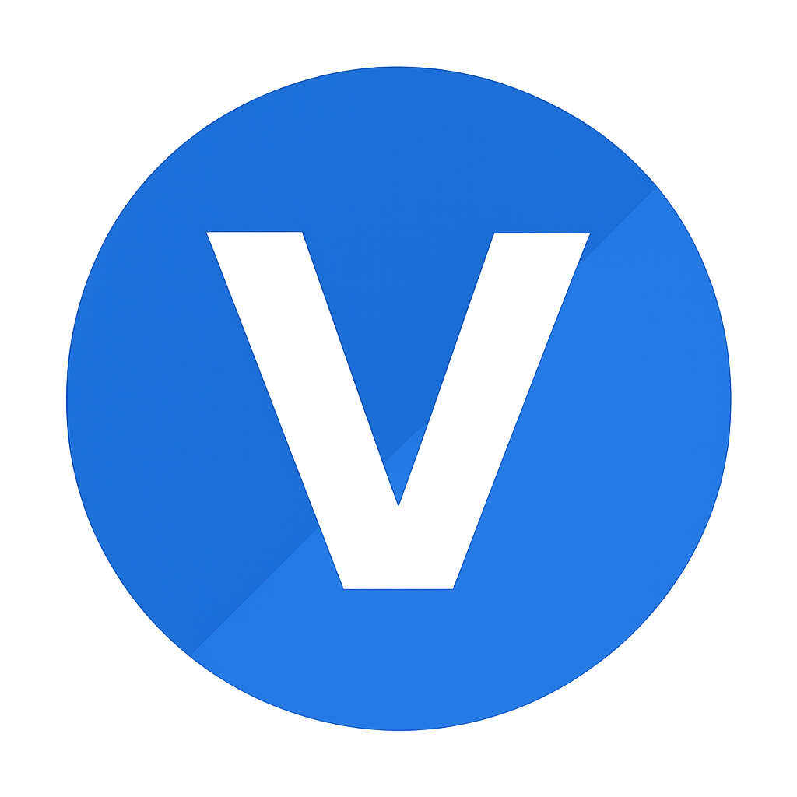

#   

  
  
  
  

> **My Portfolio** is a modern, interactive, and visually appealing personal website.  
> It showcases my **skills, experience, projects, and about me** in an elegant and engaging way.  
> Built with **React, TailwindCSS, Framer Motion, and Lenis smooth scroll**, this portfolio reflects both my technical skills and design aesthetics.  

---

# Live Link  
> <a href="https://portfolio-peach-theta-gbghx5snbg.vercel.app/" target="_blank">Open Portfolio</a>  

---

## 🚀 Features  

✅ Smooth, modern UI with **Lenis-powered scrolling**  
✅ **Framer Motion animations** for a lively and engaging experience  
✅ **Responsive design**, optimized for all screen sizes  
✅ **Showcases my projects**, skills, and work experience  
✅ Clean code and modular structure  
✅ Deployed on **Vercel** for fast performance  

---

## 🌍 Use Case  

- Recruiters or clients can **explore my skills and past work** in one place  
- Developers/designers can take **inspiration** for their own portfolio  
- Provides an **interactive resume** that looks great on both desktop and mobile  

---

## 🛠️ Tech Stack  

| Frontend | Styling | Animations | Scrolling | Deployment |
|----------|---------|------------|-----------|-------------|
|  |  |  | Lenis |  |

---

## 📦 Installation & Setup  

1. **Clone the repository**  
   ```bash
   git clone https://github.com/vishalvishwas01/Portfolio.git

2. **Navigate into the project folder**
   ```bash
   cd Portfolio
3. **Install dependencies**
   ```bash
   npm install
4. **Run the development server**
   ```bash
   npm run dev

